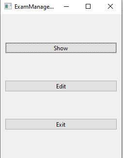
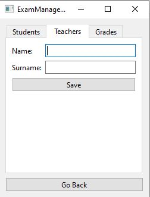
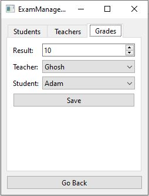
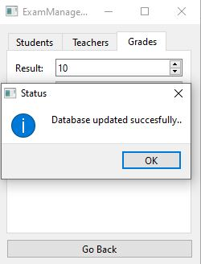
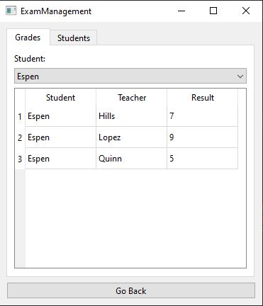

# Model View Example with QT Framework

This repository contains a simple qt gui application. It is intended to demonstrate as wide an array of features as possible while still keeping the app simple and easy to understand.

## Installation
First, install the programs required to run the application:

- [Qt](https://www.qt.io/)

Next, clone this repository and install dependencies:

```
git clone https://github.com/mertsert/qt-model-view-example.git
```
Dependencies :
  - Qt 5.12.4
  - MinGW-w64
  - Sqlite

Open `ExamManagement.pro` file with QtCreator Ide -> `Run qmake` and `Build` 

## Views

Application start with main window:



Adding Student or Teacher from Edit Window with their tabs:





Showing Student or Grades from Show Window with their tabs:


